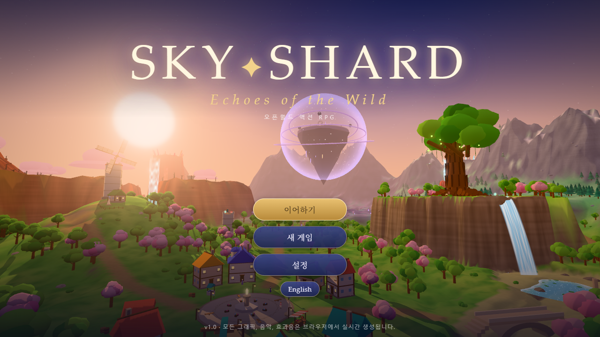

# Skyshard: Echoes of the Wild

**세 개의 스카이샤드를 찾아 별을 구하는 3D 오픈월드 액션 RPG.**

[](https://github.com/Legerdo/skyshard-echoes-of-the-wild/actions/workflows/pages.yml)

[플레이하기](https://legerdo.github.io/skyshard-echoes-of-the-wild/) · [저장소](https://github.com/Legerdo/skyshard-echoes-of-the-wild)



## 게임 소개

신록의 들녘, 잿불 협곡, 창공 고원을 탐험하고 세 개의 스카이샤드를 되찾으세요. 메인 퀘스트와 인물들의 이야기를 따라가며 원소 전투, 보스전, 퍼즐을 즐길 수 있습니다.

## 주요 특징

- 직접 만든 3D 오픈 월드와 지역별 탐험
- 점프, 활강, 등반, 상승 기류를 이용한 이동
- 원소 스킬과 원소 반응을 활용하는 전투 및 보스전
- 파티 구성, 캐릭터 전환, 장비와 유물 관리
- 메인 퀘스트, 부가 퀘스트, NPC 대화와 퍼즐
- 한국어·영어 및 게임패드 지원
- 진행 상황을 브라우저에 저장

## 조작법

| 동작 | 기본 조작 |
| --- | --- |
| 이동 | `W` `A` `S` `D` 또는 방향키 |
| 시점 조작 | 마우스 |
| 점프 / 활강 | `Space` |
| 질주 / 대시 | `Shift` 또는 마우스 오른쪽 버튼 |
| 공격 | 마우스 왼쪽 버튼 또는 `K` |
| 원소 스킬 / 원소 폭발 | `E` / `Q` |
| 상호작용 | `F` |
| 캐릭터 전환 | `1`–`4` |
| 지도 / 일지 | `M` / `J` |
| 파티·소지품 | `I` 또는 `C` |
| 일시정지 | `Esc` 또는 `P` |

게임패드를 지원하며, 설정 메뉴에서 키 설정을 바꿀 수 있습니다.

## 실행하기

개발 환경에는 **Node.js 20.19 이상 또는 22.12 이상**이 필요합니다.

```bash
git clone https://github.com/Legerdo/skyshard-echoes-of-the-wild.git
cd skyshard-echoes-of-the-wild
npm ci
npm run dev -- --open
```

Windows에서는 프로젝트 루트의 `run.bat`을 더블클릭해 실행할 수도 있습니다.

### 빌드와 미리보기

```bash
npm run build
npm run preview
```

미리보기 서버는 `http://localhost:4173/`에서 실행됩니다.

## 기술 스택

- TypeScript
- Three.js
- Vite

## 프로젝트 구조

```text
src/
├── audio/     오디오와 음악
├── combat/    전투, 원소, 캐릭터 기술
├── core/      입력, 설정, 저장, 공통 기능
├── enemies/   적과 보스
├── game/      게임 진행, 파티, 스토리
├── player/    플레이어와 카메라
├── quest/     퀘스트, 대화, 상호작용 오브젝트
├── ui/        HUD, 메뉴, 지도, 화면
└── world/     지형과 월드 구성
```

## 배포

`main` 브랜치에 변경 사항을 올리면 GitHub Actions가 빌드하고 GitHub Pages에 배포합니다. 배포 설정은 [`.github/workflows/pages.yml`](.github/workflows/pages.yml)에 있습니다.
